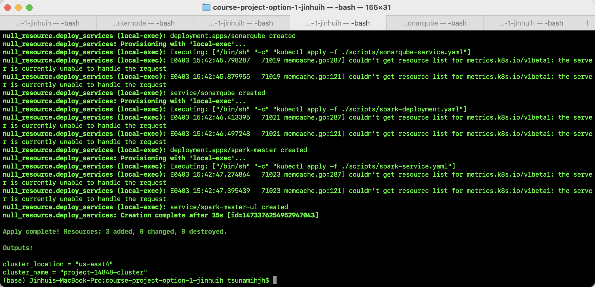
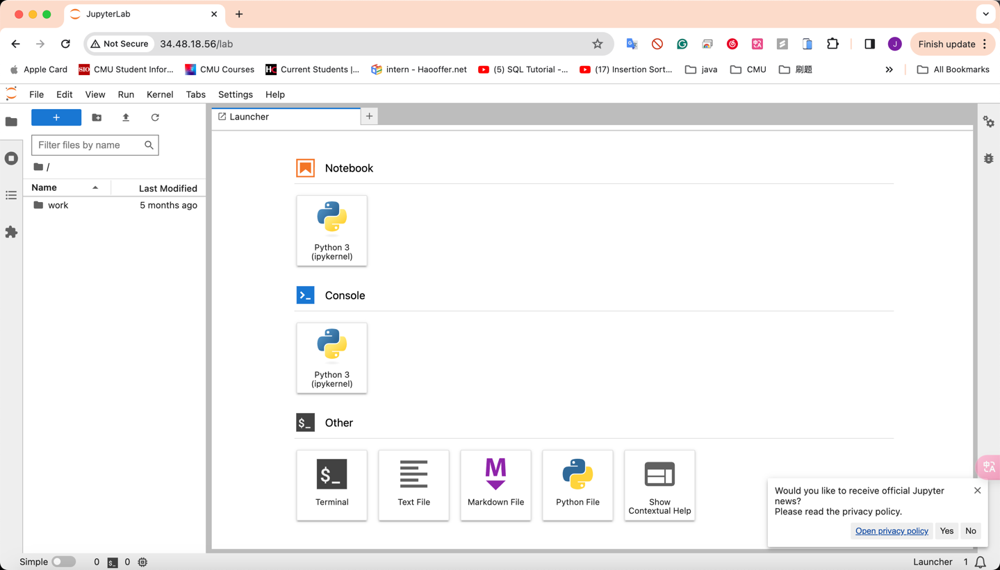

[](https://classroom.github.com/a/ChlFe71N)

# Project: Big Data Processing Toolbox

### Team Member:
    Jinhui Hong (jinhui)
    Keaton Ma (yuefengm)

### Video demo and code walk through:
   ```
   https://youtu.be/xUgeRXgrJ0I
   ```

## Deployment Steps:

### The images we used:
#### List of all URLs for the Docker Hub images:
1) jupyter: https://hub.docker.com/r/jupyter/base-notebook (built by others)
2) hadoop:
   * namenode: https://hub.docker.com/r/jinhuih/my-namenode 
   * datanode: https://hub.docker.com/r/jinhuih/my-datanode
3) jenkins: https://hub.docker.com/r/jinhuih/my-jenkins
4) sonarqube: https://hub.docker.com/r/jinhuih/sonarqube-auto-login
5) spark: https://hub.docker.com/r/bitnami/spark (built by others)
6) frontend: https://hub.docker.com/r/jinhuih/my-frontend (built by others)

We build hadoop, jenkins, sonarqube, and frontend by our Dockerfile(s) with customized setting and installation.

#### The steps to build our own image:
We wrote each Dockerfiles

`Those Dockerfile(s) can be found in each folder.`

Then:
1) hadoop:
   * namenode [Dockerfile](hadoop/masternode/Dockerfile)
   * datanode [Dockerfile](hadoop/workernode/Dockerfile)
    ```
   docker build -t my-namenode .
   docker tag my-namenode jinhuih/my-namenode
   docker push jinhuih/my-namenode
   
   docker build -t my-datanode .
   docker tag my-datanode jinhuih/my-datanode
   docker push jinhuih/my-datanode
   ```
2) jenkins [Dockerfile](jenkins/Dockerfile):
    ```
   docker build -t my-jenkins .
   docker tag my-jenkins jinhuih/my-jenkins
   docker push jinhuih/my-jenkins
   ```
3) sonarqube [Dockerfile](sonarqube/Dockerfile):
    ```
   docker build -t my-sonarqube .
   docker tag my-sonarqube jinhuih/my-sonarqube
   docker push jinhuih/my-sonarqube
   ```
4) frontend [Dockerfile](frontend/Dockerfile):
    ```
   docker build -t my-frontend .
   docker tag my-frontend jinhuih/my-frontend
   docker push jinhuih/my-frontend
   ```


### Terraform:
1) We add and download the GCP credentials file and name it `course-project-credentials_14848.json`


2) We reserve some ip(s) for each service and add them to corresponding loadBalancerIP in service YAML files, we also list their port for your check convenience
   ```
   jupyter: 34.48.18.56 - port: 80
   hadoop namenode: 34.145.245.86 - port:9870
   jenkins: 34.85.231.5 - port:8080
   sonarqube: 34.48.37.185 - port:9000
   spark: 35.245.167.136 - port:8080
   frontend: 35.221.47.235
   ```
   
3) We write our deployment and service YAML files, which are listed under `script` folder.

4) We write our Terraform files including: `main.tf`, `provider.tf`, `variables.tf`, `terraform.tfvars`, `output.tf`.

   The [main.tf](main.tf) includes:
   * resource "google_container_cluster" "main_gke_cluster"
   * resource "google_container_node_pool" "main_node_pool"
   * resource "null_resource" "deploy_services"

6) We run the following command to execute our terraform files:
    ```
   terraform init
   terraform plan
   terraform apply
   ```
   
6） SonarQube analysis on a public GitHub repository via Jenkins:
Simply click `build` on project page on Jenkins, which is demoed later.

Link to public GitHub repository: https://github.com/jinhuih/test-repo/

```
Important Note about Jenkins Dockerfile:

We have customized Dockerfile for Jenkins (with jenkins-sonar.yaml and config.xml under jenkins folder) 
and SonarQube so that there is no need for user manually signup/login or setup.

Dockerfile for Jenkins with SonarQube Integration:
	•	Base Image: Uses the official Jenkins LTS Docker image.
	•	Plugins: Installs Jenkins plugins, including SonarQube, Configuration as Code, and GitHub Branch Source.
	•	Configuration as Code: Copies a YAML configuration file into Jenkins to configure it via JCasC, setting the environment variable to point to this file.
	•	JVM Options: Disables CSRF protection and skips the initial setup wizard for a headless setup.
	•	System Packages: Installs necessary packages like unzip as root, then installs the SonarQube Scanner.
	•	Job Configuration: Copies a job configuration directory into Jenkins and ensures proper ownership.
	•	SonarQube Configuration: Sets environment variables for the SonarQube host IP and port.
	•	Ports: Exposes ports for the Jenkins web interface and agent connections.

jenkins-sonar.yaml: Jenkins Configuration as Code (JCasC) YAML:
	•	Security and Authorization: Configures Jenkins to disallow signup and sets it to unsecured authorization strategy.
	•	SonarQube Scanner: Defines the SonarQube Scanner installation path.
	•	SonarQube Global Configuration: Specifies global SonarQube settings including server URL and additional properties.

config.xml: Jenkins Job Configuration XML:
	•	Project Description: Sets a basic project description and configuration for GitHub project URL.
	•	Source Code Management: Configures the SCM to use Git, pointing to a specific GitHub repository and branch.
	•	Builders: Configures a SonarQube analysis step with additional arguments for project key and SonarQube credentials.

```


#### Demo for our implementation:
1. Execution Result:


2. Running Application:


3. Hadoop:

Two worker nodes:


4. Spark:


5. Jupyter:


6. Jenkins:


7. Sonarqube on Jenkins:


8. Sonarqube Main Page:


## Below is for the first checkpoint:

### Screenshot of webapp for checkpoints:


### Screenshot of Running Local for checkpoints:
docker pull bitnami/spark
docker run -p 8080:8080 bitnami/spark


docker pull jupyter/base-notebook
docker run -p 8888:8888 jupyter/base-notebook start-notebook.sh --NotebookApp.token=''


docker pull sonarqube
docker run -d --name sonarqube -p 9000:9000 sonarqube
docker run --rm -e SONAR_HOST_URL="http://host.docker.internal:9000" -v "/SonarScanner:/usr/src" sonarsource/sonar-scanner-cli


docker pull bde2020/hadoop-namenode:2.0.0-hadoop3.2.1-java8
docker run -p 9870:9870 -e CLUSTER_NAME=my-hadoop-cluster bde2020/hadoop-namenode:2.0.0-hadoop3.2.1-java8


